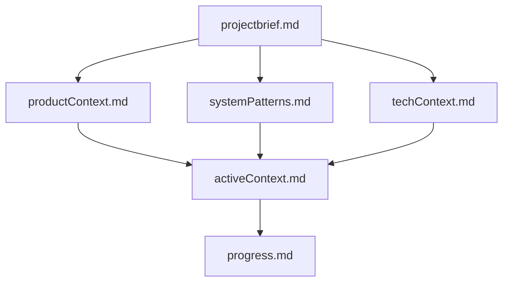

# Memory Bank

This Memory Bank contains the essential documentation and context for the Blog to Social Media project. It serves as the single source of truth for project information and is designed to be read at the start of every task.

## Core Files

- **[projectbrief.md](./projectbrief.md)**: Foundation document that shapes all other files
- **[productContext.md](./productContext.md)**: Why this project exists and how it should work
- **[systemPatterns.md](./systemPatterns.md)**: System architecture and design patterns
- **[techContext.md](./techContext.md)**: Technologies used and technical constraints
- **[activeContext.md](./activeContext.md)**: Current work focus and recent changes
- **[progress.md](./progress.md)**: What works, what's left to build, and current status

## Project Intelligence

- **[.clinerules](./.clinerules)**: Project-specific patterns, preferences, and learned insights

## How to Use

1. Read all Memory Bank files at the start of every new task
2. Update relevant files after completing significant work
3. Use the `activeContext.md` and `progress.md` files to track current state
4. Contribute to `.clinerules` as new project patterns and insights are discovered

## Memory Bank Hierarchy

The Memory Bank is structured hierarchically, where each document builds upon the foundation of those above it. All information should be consistent with the project brief.
