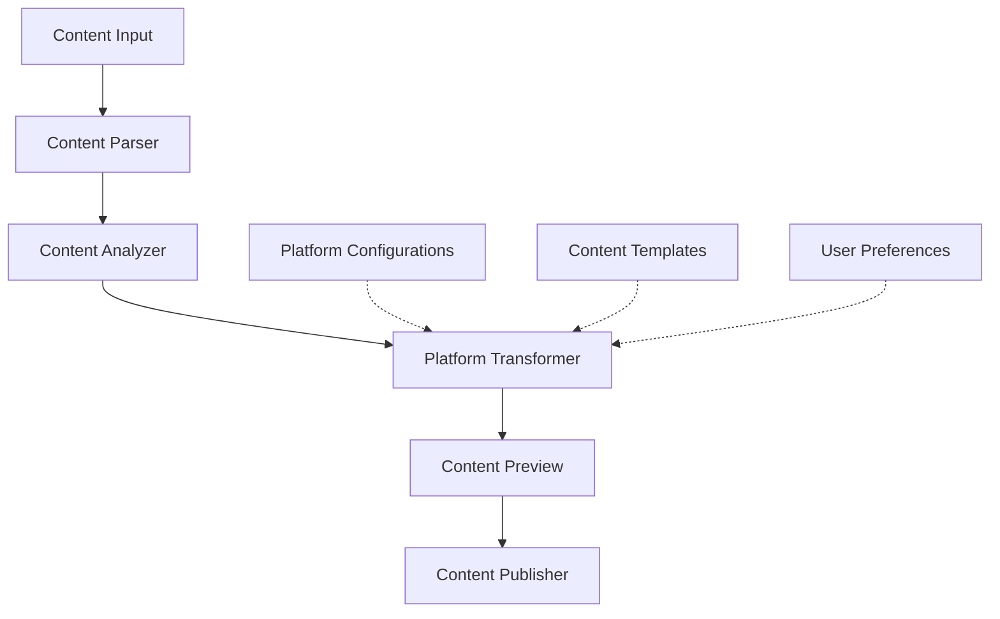

# System Patterns

## Architecture Overview
The Blog to Social Media system follows a modular architecture with the following key components:

## Key Components

### Content Input
- Handles blog content import through various methods (direct input, URL, file upload)
- Performs initial cleaning and normalization of content
- Extracts metadata (titles, images, links, etc.)

### Content Analyzer
- Identifies key messages, themes, and value propositions
- Detects content structure (headings, paragraphs, lists, quotes)
- Evaluates content length and complexity for platform suitability

### Platform Transformer
- Transforms content according to platform-specific requirements
- Applies character limits, formatting rules, and style guidelines
- Generates platform-appropriate hashtags and calls-to-action

### Content Preview
- Provides visual preview of transformed content
- Allows for user editing and refinement
- Validates content against platform rules

### Content Publisher
- Manages publishing workflow to selected platforms
- Handles scheduling and timing of posts
- Provides status monitoring and analytics integration

## Design Patterns

### Strategy Pattern
- Used for implementing different content transformation strategies for each platform
- Allows for easy addition of new platforms without changing core logic

### Template Method Pattern
- Applied to standardize the content transformation process while allowing platform-specific variations

### Observer Pattern
- Implemented for real-time content preview updates when edits are made

### Factory Pattern
- Used to create appropriate content transformers based on selected platforms

## Data Flow
1. Raw blog content enters the system
2. Content is parsed, normalized, and structured
3. Key elements are identified and prioritized
4. Content is transformed according to platform rules
5. User reviews and refines the transformed content
6. Content is scheduled or published to selected platforms

## Component Relationships
- Transformers rely on platform configurations for specific formatting rules
- Templates provide predefined structures for different content types
- User preferences influence transformation priorities
- Analytics feedback can inform future transformation strategies

*This document outlines the system architecture and key technical decisions. It will be updated as the system evolves and new patterns emerge.*
